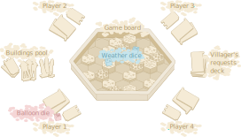

# Livret de Règles des Pluvionautes

## Principe du jeu

Explorez le ciel en tant que **pilote de montgolfière**. A la recherche de la pluie, utilisez votre ballon pour **remorquer des îles volantes** et façonner le ciel à votre avantage !

**Aidez un maximum de villageois** pour être élu meilleur **pluvionaute** du pays !

## Mise en place

1. La boîte du jeu sert de plateau. Commencez par retirer le **dé montgolfière**, les **12 cartes missions**, les **3 bâtiments phare**, les **3 bâtiments château d'eau** et les **6 bâtiments muraille** de la boîte. Les 5 tuiles **montagne**, les 6 tuiles **forêt**, les 10 tuiles de **plaine** et les **2 dés météo** restent dans la boîte.
2. Mélangez la boîte de sorte que chaque **tuile de terrain** et les **dés météo** soient placés au hasard sur le plateau. Assurez-vous ensuite que chaque tuile soit correctement placée au centre d'un emplacement hexagonal du plateau, puis placez la boîte au centre de la table.
3. Chaque joueur reçoit **1 bâtiment muraille** ainsi que une **1 cartes mission élevage** et **1 cartes mission culture** et les place face cachée devant lui. Les joueurs peuvent regarder leur propre **missions** à tout moment pendant la partie. Les **bâtiments** restants sont placé à côté du plateau pour former une **réserve commune** de bâtiments. Les **missions** restantes ne sont pas utilisés pour cette partie.
4. Le premier joueur, choisi au hasard, prend le **dé montgolfière**.

*Schéma de la mise en place, pour 4 joueurs ici.*

## Missions

Le but du jeu est d'aider un maximum de villageois en validant un maximum de **missions** et être élu le meilleur **pluvionaute** du pays.
Il existe de type de **missions** différentes:

* **Les missions d'élevage** : les villageois demandent la plus grande région possible d'un type de **terrain** donné (plaine, forêt ou montagne) indépendamment de la météo.
* **Les missions de culture** : les villageois demandent un maximum de **pluie (sans orage)** sur un type de **terrain** donné (plaine, forêt ou montagne).

Le nombre de villageois aidés est comptabilisé en fonction de l'état du plateau à la fin de la partie:
* **Pour une mission d'élevage** : le joueur aide le nombre de villageois correspondants au nombre d'animaux indiqués sur la carte pour chaque **île** qui compose la plus grande **région** du type de **terrain**  indiqué.
* **Pour une mission culture** : le joueur aide le nombre de villageois indiqués sur la carte pour chaque terrain du type indiqué qui est sous la pluie (sans orage).

## Règles de distance

La météo est contrôlé par la position des dés météo, indiquant le coeur de la météo, et leur valeur, indiquant leur porté.
Par exemple, une valeur de 2 (symbol) indique que toutes les îles qui sont à une distance de **2 OU MOINS** du dé météo sont sous la pluie.
Pour une valeur de 5 (symbol), toutes les îles qui sont à une distance de **3** sont sous la pluie (sans orage) et toutes les îles qui sont à une distance de **2 OU MOINS** sont sous l'orage. Mais attention la distance est influencée par la nature du terrain.

La tuile sur laquelle se tient le dé est considéré à une distance de 0, indépendemment du terrain (vide, plaine, forêt ou montagne).
La distance d'une tuile adjacente est par contre dépendante du **terrain** de la tuile adjacente :
* Une **tuile vide** adjacente est à une distance de **1**.
* Une **tuile plaine** adjacente est à une distance de **1**.
* Une **tuile forêt** adjacente est à une distance de **2**.
* Une **tuile montagne** adjacente est à une distance de **3**.
La distance des tuiles plus loin d'un dé est la plus petite distance pour atteindre cette tuile avec les règles de distance précédente.

Les mêmes règles de distance sont utilisés pour déterminer :
* les îles atteintes par la météo, 
* la porté maximal de **pilotage de montgolfière** (introduit dans la prochaine section)
* et la porté maximal de **remorquage d'île** (introduit dans la prochaine section).

## Déroulement du jeu

Une partie se compose de plusieurs tours que les joueurs prennent l'un après l'autre dans le sens horaire.
À tour de rôle, le joueur effectue les actions suivantes dans l'ordre :
1. **Déploiement de la montgolfière**: lancer le **dé montgolfière** sur le plateau (voir la section **subtilités du déploiement** pour plus de détails). La position où le dé s'est arrêté représente l'endroit où votre montgolfière s'est retrouvé après le déploiement. Le nombre sur le dé représente le carburant restant pour continuer à piloter le ballon.
2. **Pilotage du ballon**: déplacer le **dé montgolfière** **AU PLUS** jusqu'à la distance indiquée sur le dé (voir les **règles de distance** précédentes).
3. **Island towing:** retourner le dé ballon et déplacer cette île **AU PLUS** jusqu'à la distance indiquée par le nouveau nombre sur le dé (voir les **règles de distance** précédentes). L'île remorquée ne peut que être placée sur un emplacement vide.
4. **OPTIONNELLEMENT**, le joueur peut ensuite effectuer **UNE** des actions suivantes :
	* **Prendre un bâtiment** : choisir et prendre n'importe quel bâtiment disponible de la **réserve commune de bâtiments**.
	* **Placer un bâtiment** : placer l'un de ses bâtiments sur une case disponible **adjacente au dé montgolfière**. Un bâtiment doit toujours être placé **adjacent à une île**.	

## Influencer la météo

La météo est déterminée au hasard au début de la partie, mais peut être modifiée au cours de celle-ci :
* un joueur peut frapper un **dé météo** en le visant pendant **le déploiement de la montgolfière**.
* un joueur peut modifier l'altitude d'un **dé météo**:
	- Si une île est remorquée sous un **dé météo** situé sur une case vide, le **dé météo** augmente sa valeur en fonction du type de **terrain** de l'île :
		* si c'est une **plaine**: +1
		* si c'est une **forêt**: +2
		* si c'est une **montagne**: +3
	- Si au contraire une île est remorquée d'en dessous un dé météo, le **dé météo** reste sur place mais sa valeur diminue de manière équivalente.

Lors des changements d'altitude, la valeur du dé est limité par sa valeur minimale (1 = symbole) et sa valeur maximale (6 = symbole).
		
Remarque : Lorsque le **dé météo** se retrouve près des limites du plateau, il devient beaucoup plus stable donc difficile à changer lors du **déploiement de la montgolfière**.

## Bâtiments

Les bâtiments sont placés dans les trous rectangulaires entre les cases du plateau.

Un bâtiment **doit toujours être adjacent à une île**. À tout moment du jeu, si un bâtiment n'est plus adjacent à une île, le bâtiment est **détruit** et replacé dans la **réserve commune de bâtiments**.

Les bâtiments ont des effets différents
* la **muraile** empêche les deux îles adjacentes d'être remorquées. Deux cases séparés par un mur ne sont plus considérés comme adjacentes. La muraille agit donc comme une barrière pour la **météo**, le **pilotage de montgolfière** et les **régions**.
* le **phare** protège les deux tuiles adjacentes de l'orage.
* le **château d'eau** fournit en eau les deux tuiles adjacentes.

Remarque: les murailles, empêchant les deux îles adjacentes d'être remorquées, sont donc indestructibles. Si une île est initialement adjacente à un mur ou est amenée à proximité d'un mur, elle ne pourra plus être remorqué jusqu'à la fin de la partie.

## End of game

La partie se termine au bout de **5** tours de jeu.

Basé sur la configuration finale du plateau, chaque joueur compte ensuite le nombre de villageois qu'y ont été aidé à travers leur missions.
Le joueur qui a aidé le plus de villageois est déclaré le meilleur **pluvionaute** du pays!

## Subtilités du déploiement de montgolfière

* Lors du déploiement de la montgolfière, la main du joueur ne doit jamais survoler le plateau.
* Si le **dé montgolfière** s'arrête entre plusieurs cases, alors le joueur une parmi celle-ci comme point de départ de pilotage. De même, si un dé météo s'arrête entre plusieurs cases après un lancer, le joueur actuel choisit une de ces cases où placer le dé météo.

* Si le dé montgolfière ne s'arrête pas sur le plateau, le déploiement est annulé et chaque dé météo est remis à sa position et à sa valeur initiale d'avant le lancer. Le joueur a alors une deuxième chance pour déployer son ballon à nouveau. S'il échoue à nouveau, il passe son tour.
* Si un dé météo sort du plateau, le joueur suivant le relance juste avant son tour.
* Un joueur ne peut pas bouger ni faire tourner le plateau. Il peut cependant se lever et tourner autour de la table si nécessaire pour faciliter le déploiement de sa montgolfière.
